# Architecture Guide

## Overview

This Spring Boot microservice demonstrates an event-driven architecture that combines REST API, message broker (Solace), and cloud storage (Azure Blob Storage) to provide reliable message processing with persistence and replay capabilities.

---

## Table of Contents

- [System Architecture](#system-architecture)
- [Component Overview](#component-overview)
- [Message Flow](#message-flow)
- [Data Model](#data-model)
- [Use Cases](#use-cases)
- [Technology Stack](#technology-stack)
- [Integration Patterns](#integration-patterns)
- [Deployment Architecture](#deployment-architecture)

---

## System Architecture

### High-Level Architecture

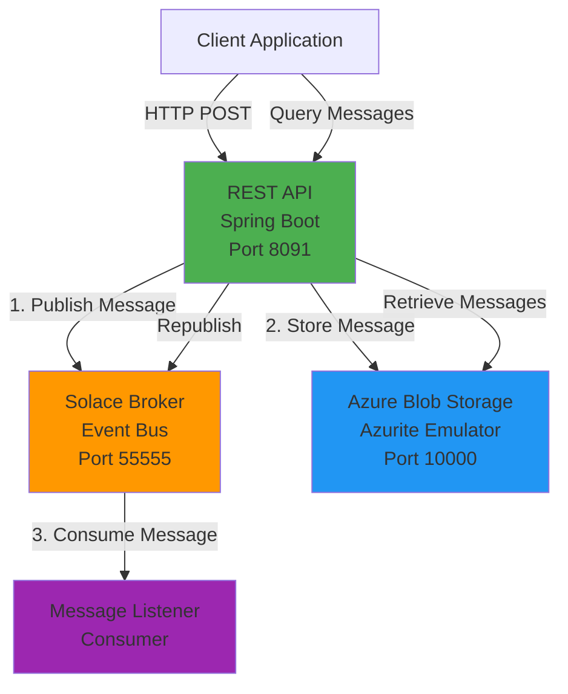

### Component Interaction Flow

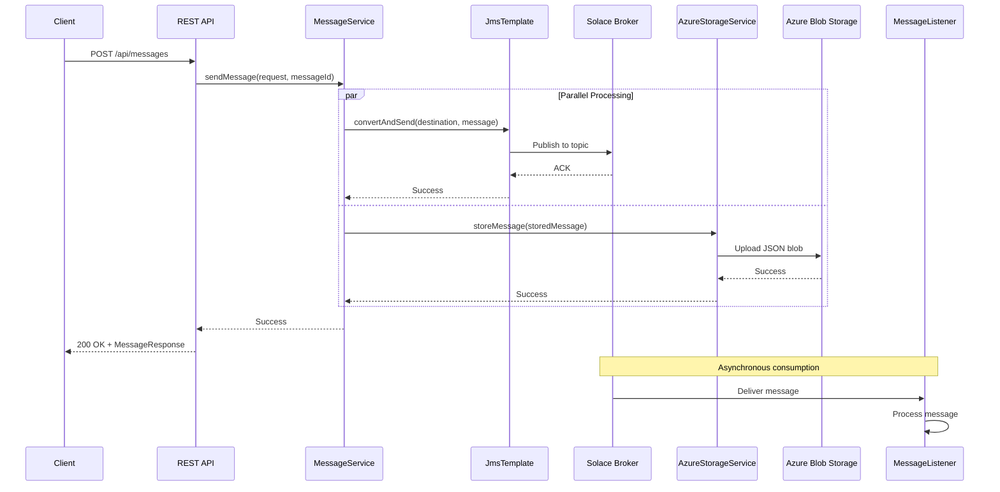

---

## Component Overview

### 1. REST API Layer

**Controllers:**
- `MessageController`: Handles message submission
- `StorageController`: Manages stored messages (CRUD operations)

**Endpoints:**
```
POST   /api/messages              - Send new message
GET    /api/messages/health       - Health check

GET    /api/storage/messages      - List stored messages
GET    /api/storage/messages/{id} - Retrieve specific message
POST   /api/storage/messages/{id}/republish - Republish message
DELETE /api/storage/messages/{id} - Delete message
GET    /api/storage/status        - Storage availability
```

### 2. Message Service Layer

**MessageService**
- Orchestrates message publishing and storage
- Integrates JmsTemplate for Solace
- Delegates storage to AzureStorageService
- Handles error scenarios

### 3. Message Broker (Solace)

**Configuration:**
- VPN: `default`
- Queue/Topic: `test/topic`
- Connection: SMF protocol on port 55555

**Message Listener:**
- Consumes messages from Solace queue
- Demonstrates asynchronous message processing
- Logs received messages

### 4. Storage Layer (Azure Blob Storage)

**AzureStorageService**
- Stores messages as JSON blobs
- Blob naming: `message-{messageId}.json`
- Container: `solace-messages`
- Supports list, retrieve, delete operations

---

## Message Flow

### Detailed Message Processing Flow

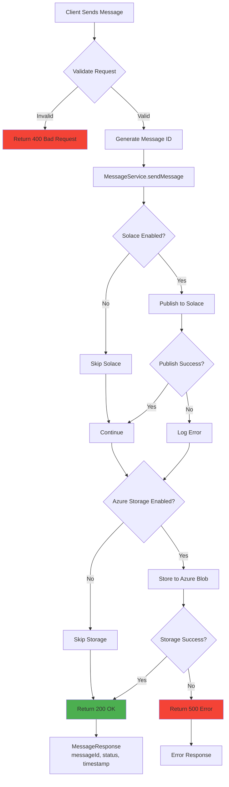

### Message Republish Flow

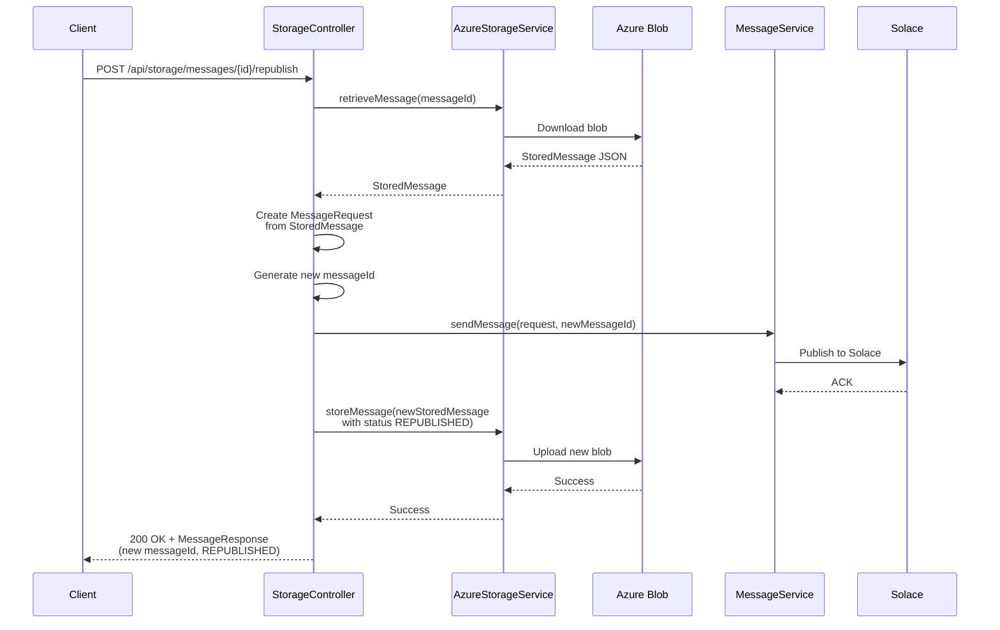

---

## Data Model

### Message Request

```json
{
  "content": "Message payload (can be any format: JSON, XML, SWIFT, HL7, CFONB, etc.)",
  "destination": "test/topic",
  "correlationId": "unique-correlation-id"
}
```

**Validation Rules:**
- `content`: Required, not blank
- `destination`: Required, not blank
- `correlationId`: Optional, for message tracking

### Message Response

```json
{
  "messageId": "uuid-generated-by-service",
  "status": "SENT | FAILED | REPUBLISHED",
  "destination": "test/topic",
  "timestamp": "2025-10-13T19:23:30.032"
}
```

### Stored Message (Blob Content)

```json
{
  "messageId": "00ef0801-99ff-4799-9128-838d8e796f6d",
  "content": "Original message content",
  "destination": "test/topic",
  "correlationId": "correlation-id",
  "timestamp": "2025-10-13T19:23:30.032",
  "originalStatus": "SENT"
}
```

**Storage Structure:**
- **Container**: `solace-messages`
- **Blob Name**: `message-{messageId}.json`
- **Content Type**: `application/octet-stream`
- **Format**: JSON

### Storage Organization

```mermaid
graph TD
    SA[Storage Account<br/>devstoreaccount1]
    SA --> C1[Container: solace-messages]

    C1 --> B1[message-{uuid-1}.json]
    C1 --> B2[message-{uuid-2}.json]
    C1 --> B3[message-{uuid-3}.json]
    C1 --> BN[...]

    B1 --> J1[JSON Content:<br/>messageId, content,<br/>destination, correlationId,<br/>timestamp, originalStatus]

    style SA fill:#2196F3
    style C1 fill:#03A9F4
    style B1 fill:#00BCD4
    style J1 fill:#B2EBF2
```

---

## Use Cases

### Use Case 1: Banking - SWIFT MT103 Payment

**Scenario:** International wire transfer of $100,000 from US to Germany

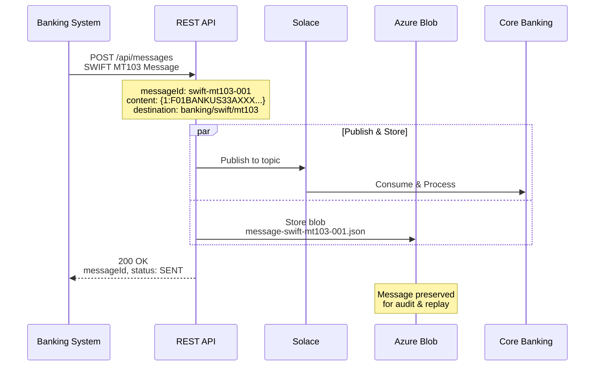

**Message Content:**
```json
{
  "messageId": "swift-mt103-20251013-001",
  "content": "{1:F01BANKUS33AXXX0000000000}{2:I103BANKDE55XXXXN}{3:{108:MT103 001}}{4:\n:20:FT21093456789012\n:23B:CRED\n:32A:251013USD100000,00\n:50K:/1234567890\nACME CORPORATION\n...",
  "destination": "banking/swift/mt103",
  "correlationId": "swift-ft21093456789012",
  "timestamp": "2025-10-13T19:23:30.032",
  "originalStatus": "SENT"
}
```

### Use Case 2: Healthcare - HL7 ADT-A01 Patient Admission

**Scenario:** Patient admitted to UCSF Medical Center

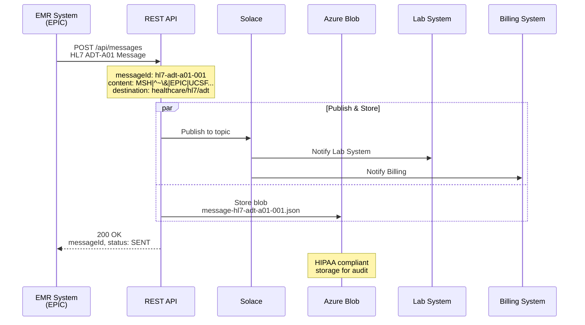

**Message Content:**
```json
{
  "messageId": "hl7-adt-a01-20251013-001",
  "content": "MSH|^~\\&|EPIC|UCSF|LAB|UCSF|20251013142536||ADT^A01|MSG00001|P|2.5\rEVN|A01|20251013142536\rPID|1||MRN123456^^^UCSF^MR||DOE^JOHN^ALLEN^^MR||19800515|M...",
  "destination": "healthcare/hl7/adt",
  "correlationId": "hl7-mrn123456-a01",
  "timestamp": "2025-10-13T19:23:30.032",
  "originalStatus": "SENT"
}
```

### Use Case 3: French Banking - CFONB 240 SEPA Payment

**Scenario:** Salary payment from French company to employees

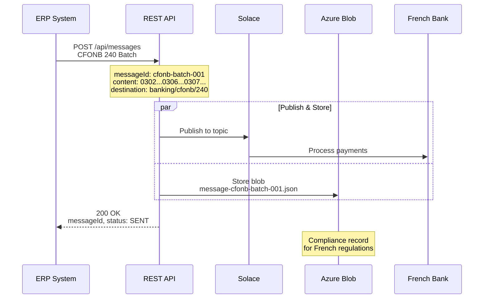

**Message Content:**
```json
{
  "messageId": "cfonb-240-20251013-001",
  "content": "0302        25101300001FR12345678901234567890123      EUR0000000000000000012345\n0306ACME FRANCE SAS...\n0307FR7612345678901234567890123BNPAFRPPXXX\n...",
  "destination": "banking/cfonb/240",
  "correlationId": "cfonb-20251013-001",
  "timestamp": "2025-10-13T19:23:30.032",
  "originalStatus": "SENT"
}
```

### Use Case 4: Message Replay/Reprocessing

**Scenario:** Downstream system was down, need to replay messages

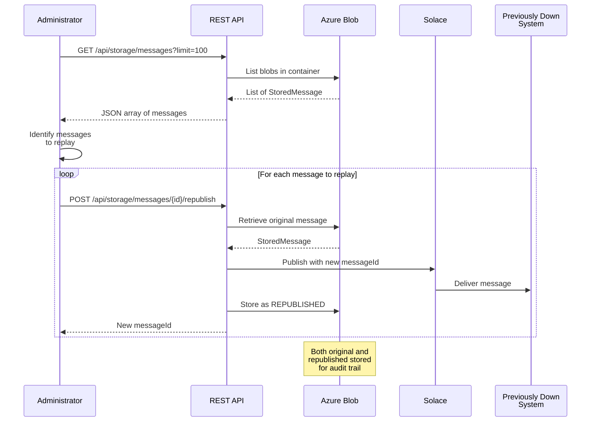

---

## Technology Stack

### Runtime Environment

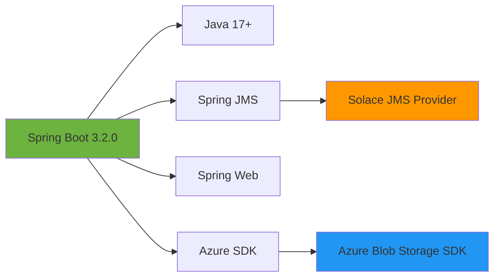

### Dependencies

| Component | Technology | Purpose |
|-----------|------------|---------|
| **Framework** | Spring Boot 3.2.0 | Application framework |
| **Message Broker** | Solace PubSub+ | Event streaming platform |
| **Storage** | Azure Blob Storage | Cloud object storage |
| **JMS** | Spring JMS + Solace JMS | Messaging API |
| **Serialization** | Jackson | JSON processing |
| **Validation** | Jakarta Validation | Request validation |
| **Testing** | Testcontainers | Integration testing |
| **Emulator** | Azurite | Local Azure Storage |

### Configuration Properties

```yaml
spring:
  jms:
    solace:
      enabled: ${SOLACE_ENABLED:false}
      host: ${SOLACE_HOST:tcp://localhost:55555}
      username: ${SOLACE_USERNAME:default}
      password: ${SOLACE_PASSWORD:default}
      vpn-name: ${SOLACE_VPN:default}

solace:
  queue:
    name: ${SOLACE_QUEUE_NAME:test/topic}
    topic: ${SOLACE_TOPIC:test/topic}

azure:
  storage:
    enabled: ${AZURE_STORAGE_ENABLED:false}
    connection-string: ${AZURE_STORAGE_CONNECTION_STRING:}
    container-name: ${AZURE_STORAGE_CONTAINER_NAME:solace-messages}
```

---

## Integration Patterns

### Pattern 1: Publish-Subscribe with Persistence

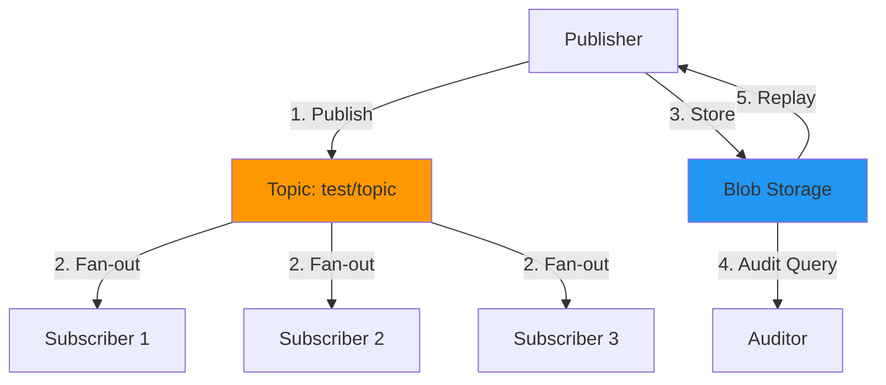

**Benefits:**
- Multiple consumers can process the same message
- Messages persist for audit and compliance
- Failed processing can be replayed

### Pattern 2: Event Sourcing

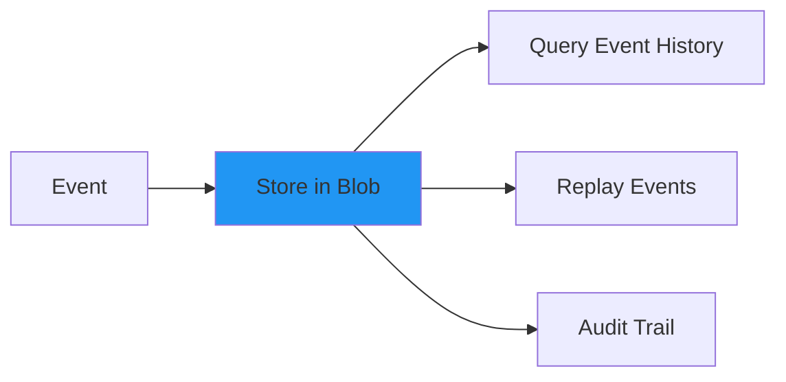

**Benefits:**
- Complete history of all events
- Time-travel debugging
- Regulatory compliance
- Disaster recovery

### Pattern 3: Async Processing with Guarantee

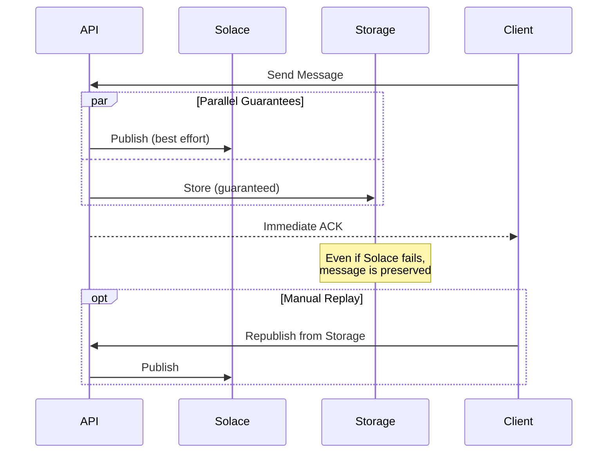

---

## Deployment Architecture

### Local Development (Docker Compose)

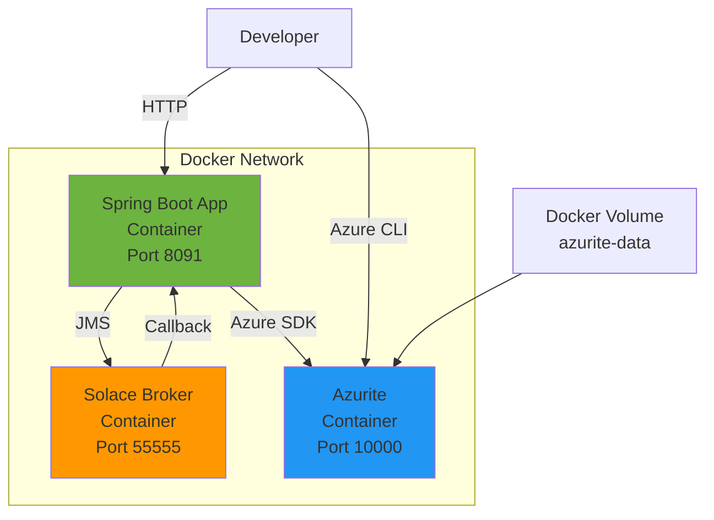

### Production (Azure Container Apps)

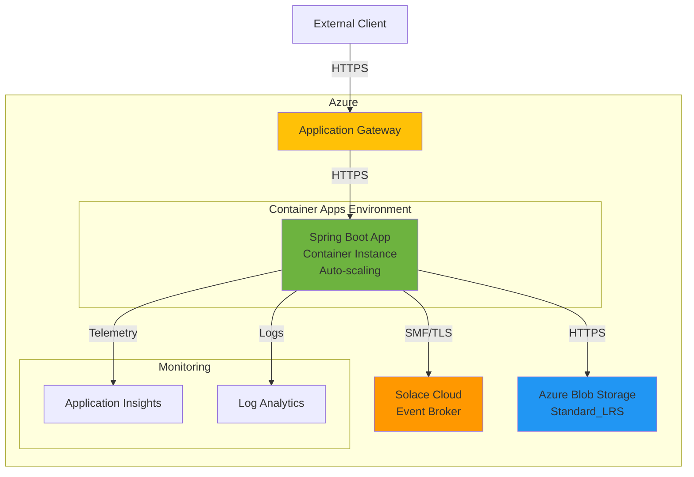

**Production Considerations:**
- **Scaling**: Horizontal pod autoscaling based on queue depth
- **Security**: TLS for Solace, HTTPS for Azure, managed identities
- **Resilience**: Circuit breakers, retry policies, dead letter queues
- **Monitoring**: Metrics, distributed tracing, alerts
- **Cost**: Pay-per-use with Azure Container Apps

---

## Message Format Support

### Supported Industry Standards

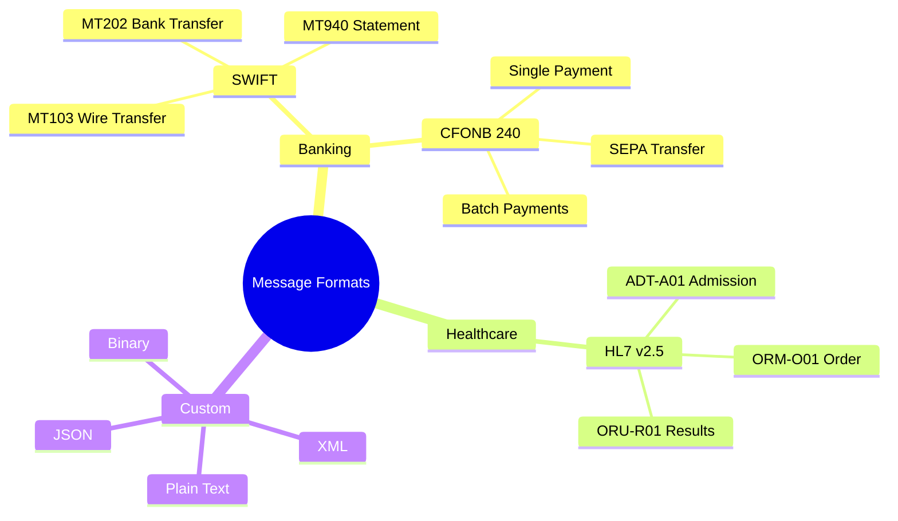

### Message Transformation

The service stores messages **as-is** without transformation:

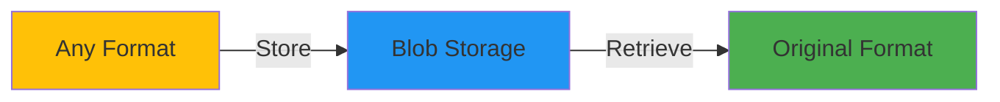

**Design Philosophy:**
- **Format Agnostic**: Service doesn't parse or transform messages
- **Preserve Fidelity**: Original message exactly as received
- **Downstream Processing**: Consumers handle format-specific logic
- **Flexibility**: Easy to add new formats without code changes

---

## Error Handling

### Error Flow

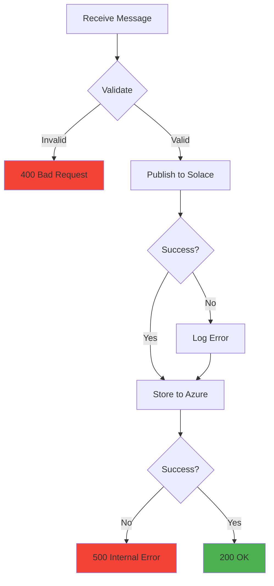

### Error Scenarios

| Scenario | Behavior | HTTP Status | Message Stored? |
|----------|----------|-------------|-----------------|
| Invalid request | Return validation error | 400 | No |
| Solace down | Log error, continue | 200 | Yes |
| Azure down | Return error | 500 | No |
| Both down | Return error | 500 | No |

---

## Performance Characteristics

### Throughput

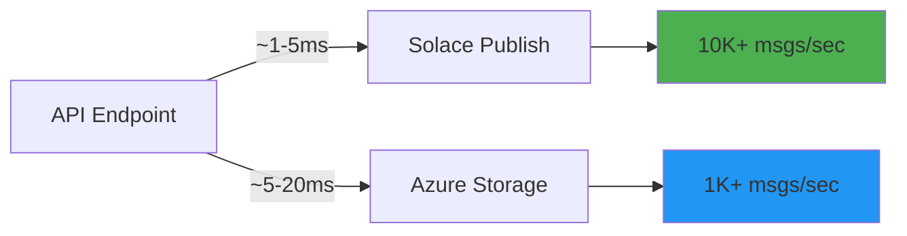

**Typical Latencies:**
- REST API processing: 1-2ms
- Solace publish: 1-5ms
- Azure Blob write: 5-20ms
- Total end-to-end: 10-30ms

### Scalability

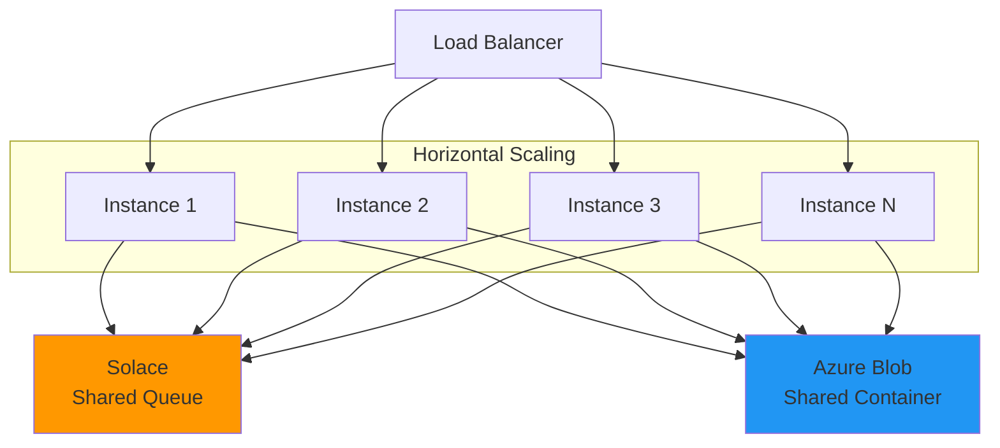

**Scaling Strategy:**
- **Stateless Design**: No local state, scales horizontally
- **Shared Resources**: Solace and Azure shared across instances
- **No Locking**: Each message independent
- **Auto-scaling**: Based on queue depth or CPU

---

## Security

### Authentication & Authorization

```mermaid
graph TB
    C[Client] -->|1. API Key/JWT| API[REST API]
    API -->|2. Solace Creds| Sol[Solace]
    API -->|3. Managed Identity| Azure[Azure Blob]

    subgraph "Production"
        API -.->|TLS| Sol
        API -.->|HTTPS| Azure
    end

    style Sol fill:#FF9800
    style Azure fill:#2196F3
```

**Security Layers:**
1. **API Security**: API keys, OAuth 2.0, JWT tokens
2. **Network Security**: TLS/HTTPS for all connections
3. **Storage Security**: Azure managed identities, no keys in code
4. **Message Security**: Encryption at rest (Azure), in transit (TLS)

---

## Monitoring & Observability

### Metrics

```mermaid
graph LR
    A[Application] --> M[Metrics]
    M --> M1[Messages Sent]
    M --> M2[Messages Stored]
    M --> M3[Error Rate]
    M --> M4[Latency P95/P99]
    M --> M5[Queue Depth]

    M1 --> D[Dashboards]
    M2 --> D
    M3 --> D
    M4 --> D
    M5 --> D

    D --> A1[Alerts]
```

**Key Metrics:**
- Request rate (req/sec)
- Error rate (%)
- Response time (ms)
- Solace queue depth
- Azure storage operations
- JVM metrics (heap, GC, threads)

---

## Related Documentation

- [README.md](README.md) - Project overview and setup
- [AZURE-STORAGE-GUIDE.md](AZURE-STORAGE-GUIDE.md) - Azure Storage details
- [TESTING.md](TESTING.md) - Testing strategy
- [smoke-test.md](smoke-test.md) - Manual testing guide
- [TESTCONTAINERS.md](TESTCONTAINERS.md) - Integration test setup

---

## Quick Start

1. **Start services:**
   ```bash
   ./run-with-solace.sh
   ```

2. **Send a message:**
   ```bash
   curl -X POST http://localhost:8091/api/messages \
     -H "Content-Type: application/json" \
     -d '{"content":"Hello World","destination":"test/topic","correlationId":"test-001"}'
   ```

3. **View stored messages:**
   ```bash
   curl http://localhost:8091/api/storage/messages
   ```

4. **Run smoke tests:**
   ```bash
   ./run-smoke-tests.sh
   ```

5. **Send industry messages:**
   ```bash
   ./send-industry-messages.sh
   ```

6. **Demo Azure CLI:**
   ```bash
   ./demo-azure-cli.sh
   ```

---

## Summary

This architecture provides:

✅ **Reliability** - Messages persisted even if broker fails
✅ **Auditability** - Complete history in blob storage
✅ **Flexibility** - Supports any message format
✅ **Scalability** - Horizontal scaling with stateless design
✅ **Observability** - Comprehensive logging and metrics
✅ **Compliance** - Storage for regulatory requirements
✅ **Replay** - Republish capability for error recovery

The combination of Solace (real-time messaging) and Azure Blob Storage (durable persistence) creates a robust event-driven system suitable for mission-critical applications in banking, healthcare, and other regulated industries.
